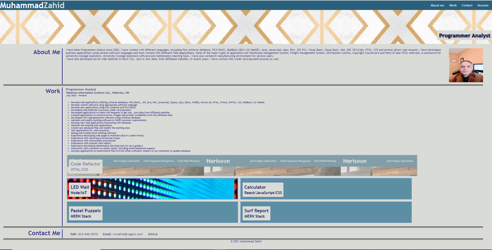

# portfolio
Portfolio BCS Assignment Number 2

This assignment present a persons portfolio on the website to potential employers about previous work.

WHEN the portfolio is loaded
IT is presented with the developer's name, a recent photo, and links to sections about them, their work, and how to contact them
WHEN the user click on one of the links in the navigation
THEN the UI scrolls to the corresponding section
WHEN the user clicks on the link to the section about their work
THEN the UI scrolls to a section with titled images of the developer's applications
WHEN the visiter is presented with the developer's first application
THEN that application's image is larger in size than the others
WHEN the visiter clicks on the images of the applications
THEN he/she is taken to that deployed application
WHEN the visiter resize the page or view the site on various screens and devices
THEN the visiter is presented with a responsive layout that adapts to the user's viewport

## Mock-Up

The following animation shows the web application's appearance and functionality:

* The URL of the deployed application : https://zahid267.github.io/portfolio/

* The URL of the GitHub repository : https://github.com/zahid267/portfolio